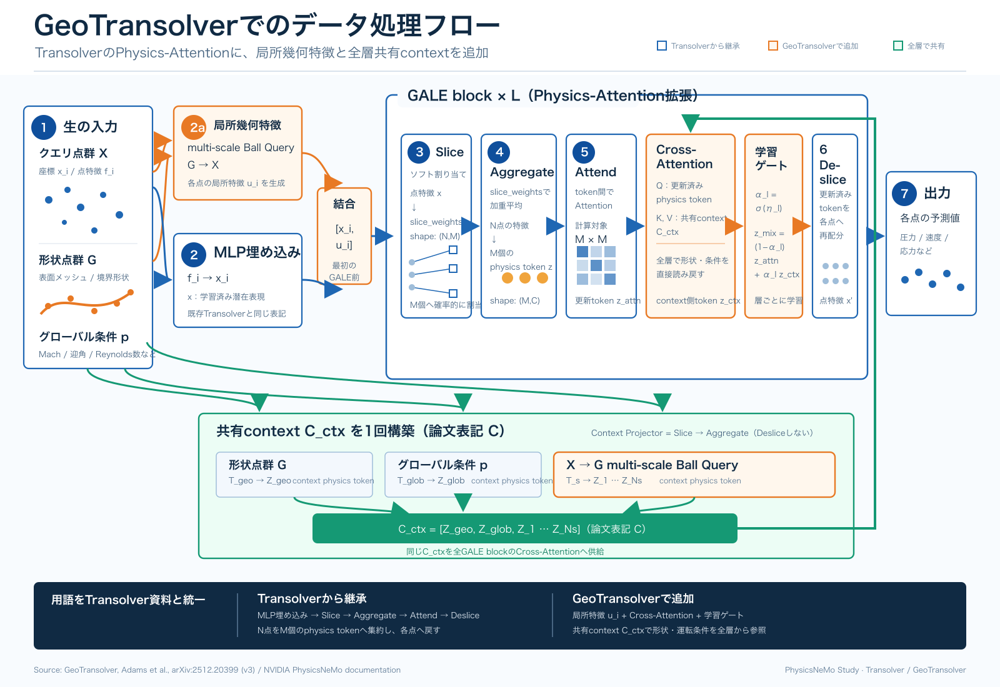
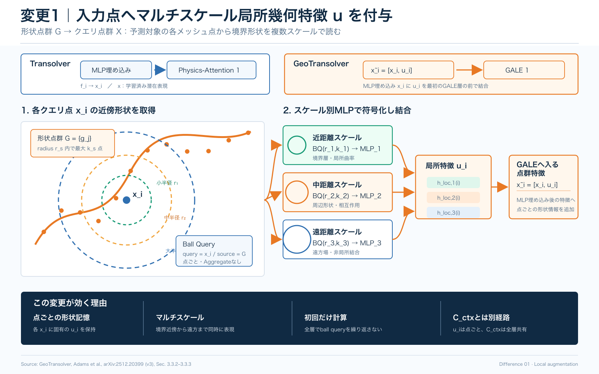
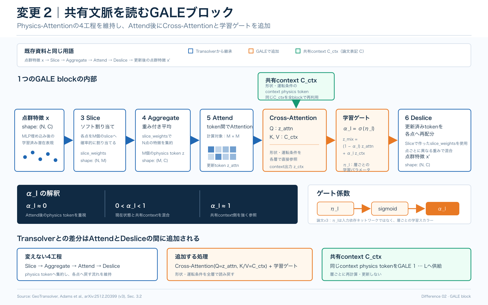
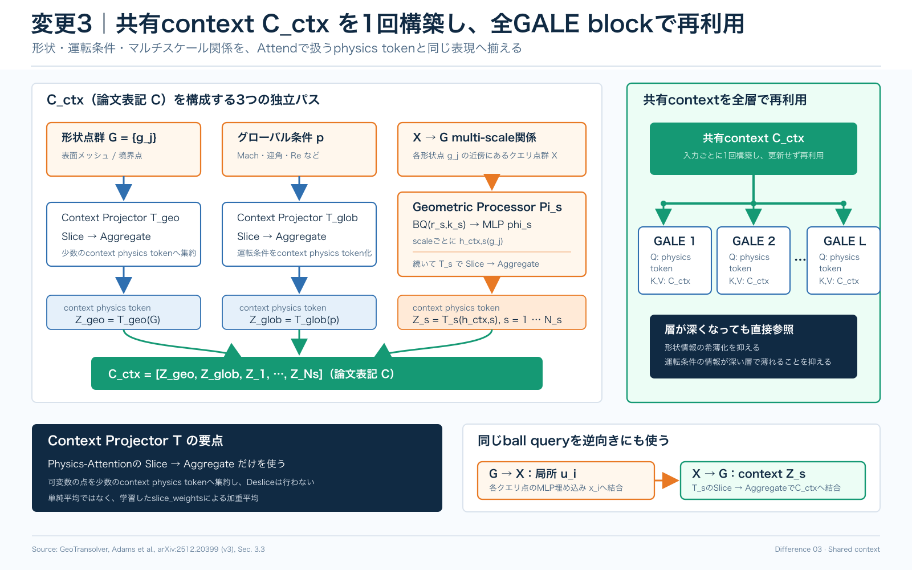

# GeoTransolver Study Materials

GeoTransolver の全体構造と、Transolver から追加された処理を日本語で確認するための学習資料です。工程名と記号は、可能な限り親フォルダの Transolver 教材に合わせています。

## Overall Flow

## Differences From Transolver

### 1. Multi-scale Local Augmentation

各クエリ点 `x_i` から形状点群 `G` を参照し、複数半径の Ball Query で得た局所幾何特徴 `u_i` を、MLP埋め込み後の点群特徴 `x_i` に結合します。

### 2. GALE Block

Transolver の `Slice -> Aggregate -> Attend -> Deslice` を維持し、Attend 後の physics token から共有context `C_ctx` への Cross-Attention と、層ごとの学習ゲートを追加します。

### 3. Shared Context

形状、グローバル条件、入力点と形状点のマルチスケール関係を、Attend で扱う physics token と同じ表現へ写像し、共有context `C_ctx` として全 GALE block で再利用します。

## GeoPT Comparison Experiment

[GeoPT / GeoTransolver 性能比較資料](GeoPT_Comparison/README.md)では、SHIFT-Wing の簡易検証により、GeoPT 事前学習済み Transolver、Scratch 学習の Transolver、Scratch 学習の GeoTransolver を比較しています。プレゼン資料と詳細レポート（PDF）を収録しています。

## Files

| Path | Role |
|---|---|
| [GeoTransolver_Flow.png](GeoTransolver_Flow.png) | 入力から物理場予測までの全体フロー |
| [GeoTransolver_Difference_01_Local_Augmentation.png](GeoTransolver_Difference_01_Local_Augmentation.png) | 入力点へ付与するマルチスケール局所幾何特徴 `u_i` |
| [GeoTransolver_Difference_02_GALE.png](GeoTransolver_Difference_02_GALE.png) | GALE 内の Slice / Aggregate / Attend / Cross-Attention / 学習ゲート / Deslice |
| [GeoTransolver_Difference_03_Shared_Context.png](GeoTransolver_Difference_03_Shared_Context.png) | 共有context `C_ctx` の構築と全層での再利用 |
| [GeoPT_Comparison/](GeoPT_Comparison/) | GeoPT と GeoTransolver の性能比較プレゼン・実験レポート |
| `*.svg` | 上記 PNG の編集可能な原稿 |

## Terminology

| Term | Meaning in these materials |
|---|---|
| MLP埋め込み | 生の点特徴 `f_i` を学習済み潜在表現 `x_i` へ変換 |
| Slice | 各点を `M` 個のsliceへソフト割り当てし、`slice_weights` を生成 |
| Aggregate | `slice_weights` による加重平均で、点特徴を `M` 個の physics token へ集約 |
| Attend | physics token 間で Attention を実行 |
| Deslice | 更新済み token を `slice_weights` により各点へ再配分 |
| `C_ctx` | GeoTransolver 論文の共有context `C`。Transolver 教材の特徴次元 `C` との衝突を避けるため本資料では `C_ctx` と表記 |
| Context Projector | Physics-Attention の `Slice -> Aggregate` に相当。context physics token を作り、Deslice は行わない |

## Source Material

- Paper: [GeoTransolver: Learning Physics on Irregular Domains Using Multi-scale Geometry Aware Physics Attention Transformer](https://arxiv.org/abs/2512.20399)
- NVIDIA PhysicsNeMo: [Transformer-Based External Aerodynamics Models](https://docs.nvidia.com/physicsnemo/latest/physicsnemo/examples/cfd/external_aerodynamics/transformer_models/README.html)

図は添付の解説メモを出発点に、上記論文の arXiv v3 と PhysicsNeMo ドキュメントで構造を照合して作成しています。

## Accuracy Notes

- 論文 v3 では、GALE のゲートは `alpha_l = sigmoid(eta_l)` で表され、`eta_l` は層ごとの学習パラメータです。
- 共有context `C_ctx` は単純平均ではなく、Context Projector の `Slice -> Aggregate` で少数のcontext physics tokenへ集約されます。Deslice は行いません。
- 局所特徴 `u_i` と共有context `C_ctx` は forward pass ごとに1回構築され、`C_ctx` は同じ入力に対する全 GALE block で再利用されます。
- Ball Query は2方向に使われます。`G -> X` は点ごとの局所特徴 `u_i`、`X -> G` は共有contextへ入るmulti-scaleなcontext physics tokenを生成します。

## Notes

- この教材は NVIDIA 公式資料ではありません。
- 本リポジトリ独自の日本語教材・補助資料の利用条件は [../../LICENSE](../../LICENSE)、第三者由来の論文・実装・商標に関する注意は [../../THIRD_PARTY_NOTICES.md](../../THIRD_PARTY_NOTICES.md) を参照してください。
